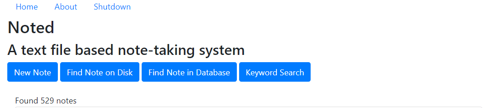
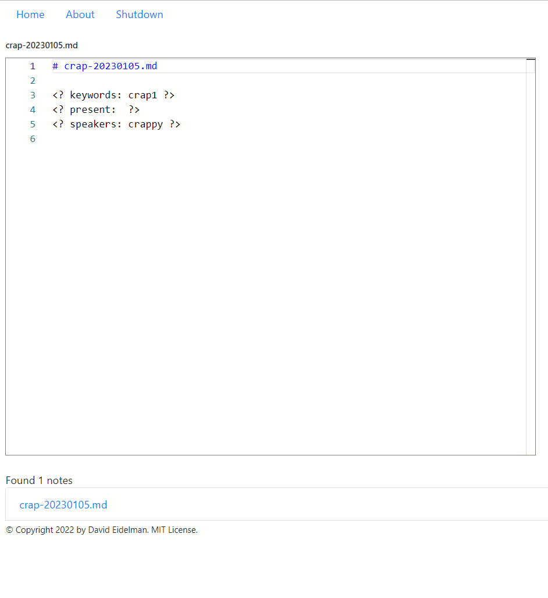

# noted

An updated version of the `dred` note-taking program, using modified markdown files to record notes.

## Configuration

The default location for the configuration file is ~/.config/noted/noted.json.  This is the same on all 
platforms.  Configuration variables currently supported include:

```json
{
    "notes_path": "C:/Users/David/OneDrive - McGill University/rawnotes", 
    "backup_path": "C:/Users/David/OneDrive - McGill University/rawnotes",
    "database_path": "C:/Users/David/OneDrive - McGill University/rawnotes/noted.sqlite3",
    "initialized": true,
    "version": "0.3.0",
    "autosave": true,
    "use_gui": false
}
```

Currently, only ```notes_path``` and ```database_path``` are recognized by the program.

## Operation

At the top of each page is are navigation links to the home page, the about page, and server shutdown.

The home page allows for the creation of new notes and searches for files on disk or in the database.  It
is also possible to search for files by keyword.  The page initially displays all notes currently in the
```notes_path```.



The editor page permits the editing of new files or the read-only review of existing files (there is a 
button to override the read-only status).  When a new note is created, all the notes with the same stem
are displayed.  For example, a new note with the filename `bob-20230101.md` would list all filenames 
beginning with bob, such as `bob-20221212.md`, etc.


The database stores files based on filename __and__ timestamp.  This has the effect of creating an 
immutable record of files.  If a file is modified on a subsequent occasion, the original file data
is still available in the database.

The database is updated whenever the server is shut down.

## Implementation

This project uses an embedded web server (currently running on [Bottle v. 0.12](https://bottlepy.org/docs/0.12/)) 
and an embedded [Sqlite3](https://www.sqlite.org/index.html) database .  The interface is implemented as 
[Jinja2](https://palletsprojects.com/p/jinja/) templates in HTML and Javascript. Editing is done using the
[monaco editor](https://microsoft.github.io/monaco-editor/) from Microsoft.

<hr/>
<footer>Copyright &copy; 2023. David Eidelman. MIT License.</footer> 


 
